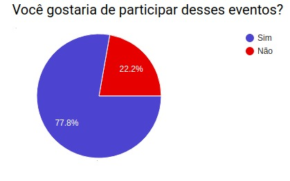
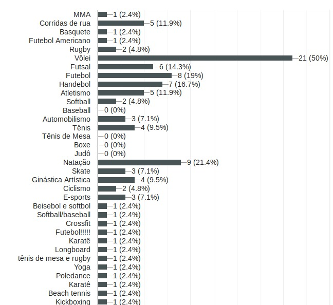
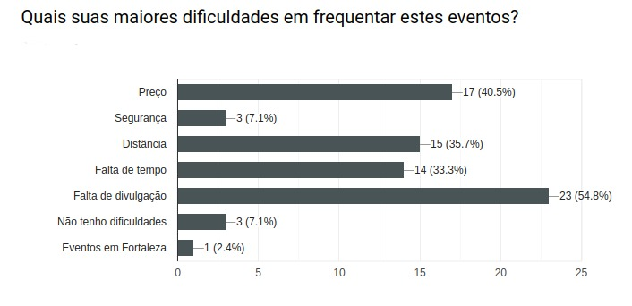
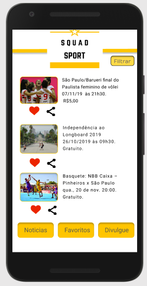
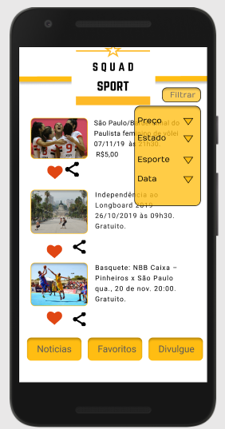
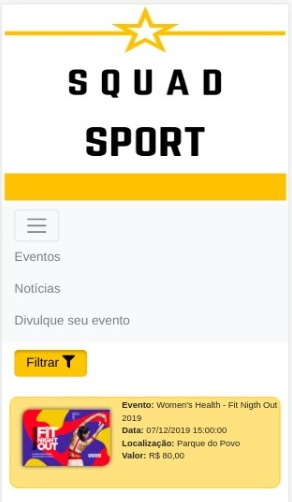
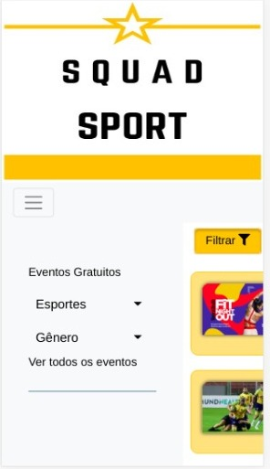
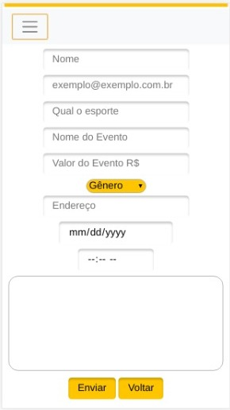
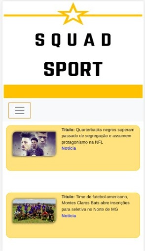

# Squad-sport

## Índice

* [1. Sobre o projeto](#1-sobre-o-projeto)
* [2. Histórias de usuários](#2-historias-de-usuarios)
* [3. Funcionalidades da aplicação](#3-funcionalidade-da-aplicacao)
* [4. Protótipos](#4-prototipos)
* [5. Próximas versões](5-proximas-versoes)
* [5. Ferramentas utilizadas](6-ferramentas-utilizadas)
* [6. Pessoas envolvidas no projeto](7-pessoas-envolvidas)

***

## 1. Sobre o projeto
***
Este é um site desenvolvido para aproximar amantes do esporte com eventos espotivos, possibilitando acessar informações sobre diversas modalidades e também aproxima os clubes dos torcedores, divulgando eventos dos times.

A partir de questionários e entrevistas, verificamos que a maioria das pessoas entrevistadas não participava de eventos esportivos por conta da falta de divulgação e a descentralização de informações desses eventos.

* _Interesse de participar_

* _Modalidades de interesse_

* _Dificuldades_

Assim procuramos desenvolver um site que centralize os eventos esportivos de diversas modalidades em um único lugar.

***
## 2. Histórias de usuários
***

_1_: Como usuário, desejo vizualizar todos os eventos na tela principal.

_2_: Como usuário, desejo filtrar os eventos por modalidade.

_3_: Como usuário, desejo filtrar os eventos por gênero.

_4_: Como usuário, desejo ordenar os eventos por preço.

_5_: Como usuário, desejo divulgar meu evento esportivo.

_6_: Como usuário, desejo visualizar notícias sobre esportes.

***
## 3. Funcionalidades da aplicação
***

Com base nas histórias de usuários, foram desenvolvidadas as seguintes funcionalidades:

* Vizualizar todos os eventos na tela principal
* Filtrar os eventos por modalidade ou gênero
* Ordenar eventos por preço
* Incluir eventos
* Vizualizar notícias esportivas

As funcionalidades tiveram as usabilidades testadas manualmente, sendo possível corrigir os erros apresentados durante o desenvolvimento.

***
## 4. Protótipos
***

Após estabelecer as funcionabilidades, fizemos um esboço do protótipo com rotas e paletas de cores a ser utilizada. O site foi desenvolvido com o conceito de [_mobile first_](ttps://tableless.com.br/obile-first-a-arte-de-pensar-cm-foco/), tendo a responsividade pensada desde o início do projeto.

_Fotos do protótipo_

_Fotos do layout_

***
## 5. Próximas versões
***
No planejamento desta aplicação consta as seguintes funcionalidades para as próximas versões:

* Cadastro do usuário, permitindo favoritar modalidades.
* Permitir o usuário compartilhar eventos com outras aplicações
* Permitir o usuário reservar seu ingresso para um evento
* Site totalmente responsivo
* Filtrar eventos selecionando uma ou mais modalidades
* Um mapa que mostra a localização dos eventos próximo a localização do usuário
* Ampliar a base de dados com eventos em todo território nacional.

***
## 6. Ferramentas utilizadas
***

Para desenvolver a aplicação, utilizamos as seguintes ferramentas:

* JavaScript
* Bootstrap
* HTML
* CSS
* Firebase
* Firestore
* API
* Git
* GitHub
* Visual Studio Code
* Trello

***
## 7. Pessoas Envolvidas
***

* Thamires Oliveira Gomes (https://github.com/thamiresoliveiragomes)
* Tayara Caires (https://github.com/tayaracaires)
* Andreza Amorim (https://github.com/AndrezaAmorim)
* Fabiana Soares (https://github.com/Fabiana-Soares)
* Catarina Barbosa (https://github.com/catbarbosa)
